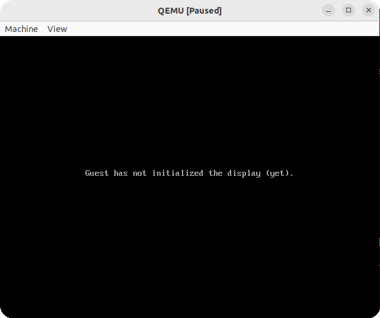
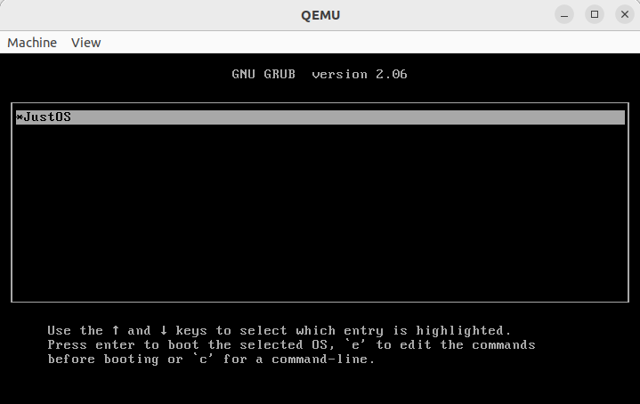

# Отладка в консоли

---

## Проблематика

Раз уж мы вступили на тропу разработки ядра ОС, то об удобствах, доступных обычным нормисам, можно забыть. К этому относится и отладка прямо внутри **IDE**, как в **Visual Studio** или **Qt Creator**. Нам же остаётся, стиснув зубы, жёстко затерпеть и отлаживать прямо в консоли. Поначалу это может показаться неудобным, но со временем приходит смирение, и ты привыкаешь даже к такому… 😔

На самом деле проще отлаживать в консоли, чем разбираться, как подключиться из **IDE** к **GDB-серверу**. Но если кому-то интересно, вот [инструкция](https://doc.qt.io/qtcreator/creator-how-to-debug-remotely-gdb.html) для **Qt Creator**.

## Прыжок веры

Итак, запустим ISO-образ в QEMU в режиме отладки через GDB:
```bash
make debug
```
Если вы уже видели корневой [CMake-файл](../../CMakeLists.txt), то давайте сразу перейдём к структуре команды и флагов:
* `-cdrom ${CMAKE_BINARY_DIR}/${TARGET_NAME}.iso` – подключает ISO-образ как CD-ROM.
* `-vga std` – использует стандартный VGA-видеорежим в QEMU.
* `-S` – останавливает виртуальную машину сразу при старте. Она не начнёт выполнять код, пока к ней не подключится отладчик и не даст команду продолжить выполнение.
* `-gdb tcp::1234` – запускает GDB-сервер на локальном адресе `127.0.0.1` и порту `1234`.

Тем самым эта кастомная команда собирает ISO, запускает его в QEMU, сразу ставит виртуальную машину на паузу и ждёт подключения GDB на порту 1234.
После запуска будет следующая картина:


Теперь откроем новый терминал и подключимся к GDB-серверу:
```bash
make gdb
```
Тут всё проще, чем с первой командой: у нас всего один флаг:

* `-ex` – даёт понять, что следующее выражение, заключённое в кавычки, нужно сразу выполнить внутри GDB.

В итоге мы сразу подключаемся к удалённому серверу, устанавливаем брейкпоинт в функции `main` и продолжаем выполнение виртуальной машины.

Теперь, если мы снова откроем QEMU, то сможем выбрать наше ядро :)


## Полезные команды

| Команда                               | Назначение                                           | Пример                          |
| ------------------------------------- | ---------------------------------------------------- | ------------------------------- |
| `gdb ./program`                       | Запустить GDB для исполняемого файла                 | `gdb ./app`                     |
| `run` / `r`                           | Запустить программу внутри GDB                       | `run`                           |
| `run arg1 arg2`                       | Запустить программу с аргументами                    | `run input.txt 10`              |
| `break <место>` / `b <место>`         | Поставить breakpoint                                 | `break main`, `break file.c:42` |
| `info breakpoints`                    | Показать список breakpoint’ов                        | `info breakpoints`              |
| `delete <номер>`                      | Удалить breakpoint                                   | `delete 1`                      |
| `disable <номер>`                     | Временно отключить breakpoint                        | `disable 2`                     |
| `enable <номер>`                      | Включить отключённый breakpoint                      | `enable 2`                      |
| `next` / `n`                          | Выполнить следующую строку, не заходя внутрь функций | `next`                          |
| `step` / `s`                          | Выполнить следующую строку с заходом внутрь функции  | `step`                          |
| `continue` / `c`                      | Продолжить выполнение до следующего breakpoint’а     | `continue`                      |
| `finish`                              | Выполнить текущую функцию до конца и выйти из неё    | `finish`                        |
| `print <выражение>` / `p <выражение>` | Вывести значение переменной или выражения            | `print counter`, `p arr[0]`     |
| `display <выражение>`                 | Автоматически выводить значение при каждой остановке | `display i`                     |
| `info locals`                         | Показать локальные переменные текущей функции        | `info locals`                   |
| `info args`                           | Показать аргументы текущей функции                   | `info args`                     |
| `backtrace` / `bt`                    | Показать стек вызовов                                | `backtrace`                     |
| `frame <номер>`                       | Перейти к конкретному кадру стека                    | `frame 2`                       |
| `list` / `l`                          | Показать исходный код вокруг текущей строки          | `list`                          |
| `watch <переменная>`                  | Остановить программу при изменении переменной        | `watch count`                   |
| `set var <переменная>=<значение>`     | Изменить значение переменной во время отладки        | `set var i=0`                   |
| `quit` / `q`                          | Выйти из GDB                                         | `quit`                          |
